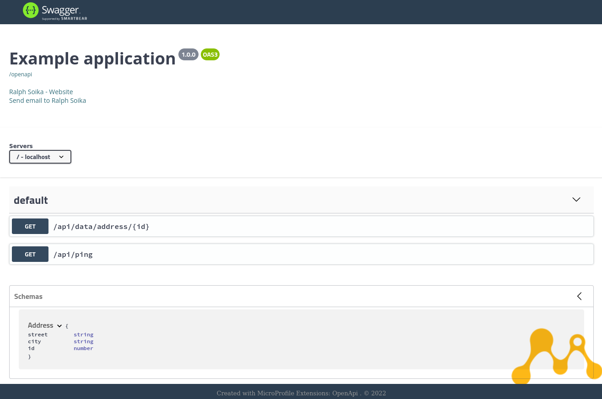

# Hello World Example on Jakarta EE 8

This is a basic Microservice example running on Jakarta EE 8. It includes a Rest Service example and also a Health Service.
The project runs with JDK 11. In a Jakarta EE 8 application the namespace `javax.*` is still used instead of `jakarta.*`.

## Build

The project is based on Docker. To build the project you can run:

	$./buildAndRun.sh

This will run a Maven build, creating a new Docker image and starting the server

To manually build and run you can run the following commands:

	$ mvn clean package && docker build -t com.ralph.microprofile/hello-world .
	$ docker run -d -p 8080:8080 --name hello-world com.ralph.microprofile/hello-world 
	

	
## The Rest API

The Microservice proivdes 2 simple Rest API endpoints:

### The Ping Service

The Ping resource just returns a ping message with a timestamp:

	http://localhost:8080/api/ping

### The Address Service

The Address resource is an example how to deal with POJOs in a Rest API method.

	http://localhost:8080/api/data/address/123

The Service creates a simple Address Java Object and returns the object data requested in JSON or XML
	
	

### Swagger	

The Microservice also includes a Swagger UI.

	http://localhost:8080/api/openapi-ui/
	

	

## Logging

All implementations use the standard java logger `java.util.logging.Logger` to print log messages to the server log file. So there is not extra logging framework needed.
	
## Health 

Based on Jakarta EE 9 and Microprofile 3 the Microservice also provides an example Healthcheck endpoint:

On Wildfly (default): 

	http://localhost:9990/health
	
On Payara: 

	http://localhost:8080/health

	
Learn more about the [Microprofile Health API](https://microprofile.io/project/eclipse/microprofile-health).	
	
## Inject Configuration Params via Environment variables

The project includes a configuration example. 

The Ping Service reads in each request the Environment variable `MAIL_HOST` and prints out the value into the server log file.
This is an example how you can externalize configuration to environment variables. For example in this way you can set different values for different environments. 

Learn more about the [Microprofile Config API](https://microprofile.io/project/eclipse/microprofile-config).

	