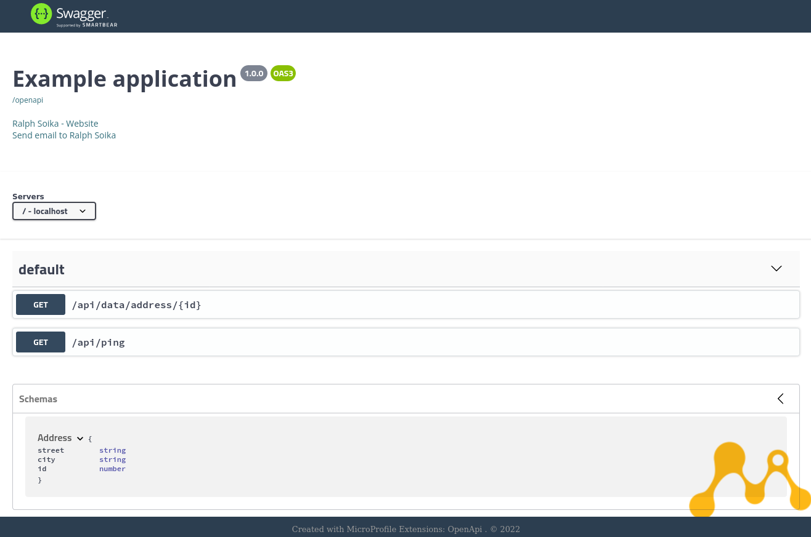
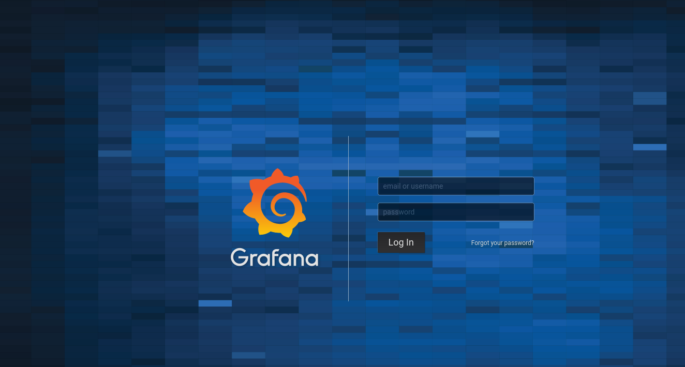
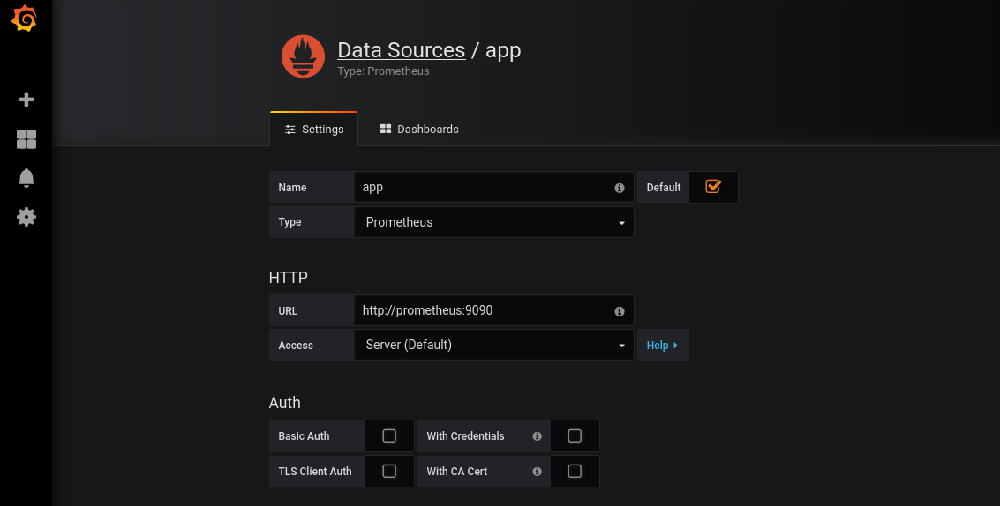
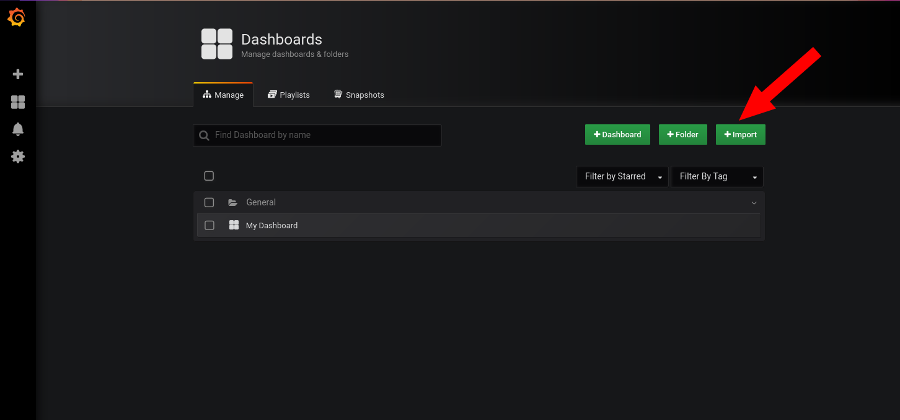
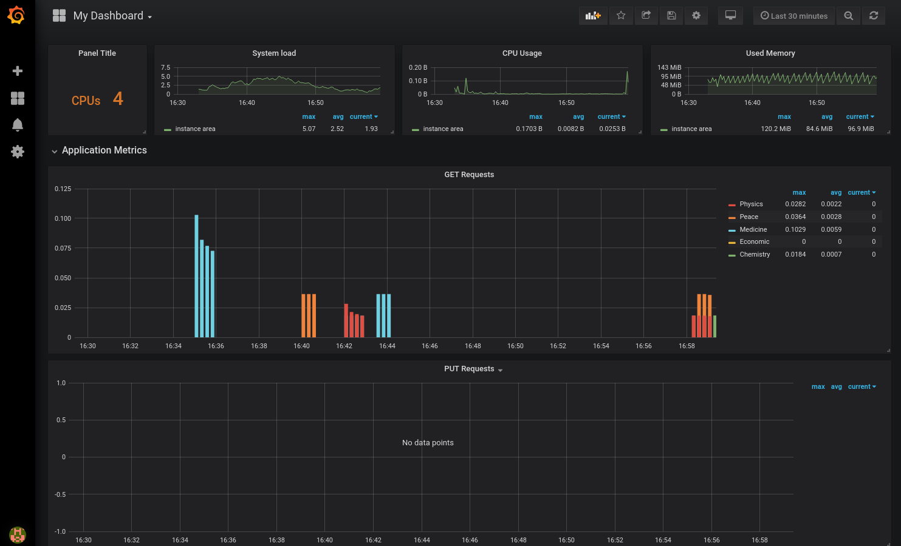

# Metrics Example on Jakarta EE 8

This is a Microservice example running on Jakarta EE 8 in combination with the Microprofile Metrics API. 
Metrics 4.0 gives you a great way to monitor your runntime and your application.  Microprofile Metrics API is collecting custom metrics and provides them in the common prometheus format. This makes it easy to visualize and monitor any kind of application parameters. Also it allows you to setup a alerting with the help of Grafana in just a view minutes

## Build

The project is based on Docker. To build the project you can run:

	$./build.sh

This will run a Maven build, creating a new Docker image. To start the microservice use Docker-Compose. The provided docker-compose.yaml file will start the microservice and also a Prometheus and Grafana Servier to monitor the results.

	$ docker-compose up	

	
## The Rest API

The Microservice contains a simple Rest API endpoint providing Nobel Price winners of 2021:

### The nobelprice Service

The `nobelprize` resource returns a list of all data stored in the example database:

	http://localhost:8080/api/data/nobelprize/

Each nobelPrize has an id (1 - 11). You can GET one price holder by its id:

	http://localhost:8080/api/data/nobelprize/1

returns:

	{
	  "name": "Klaus Hasselmann",
	  "year": 2021,
	  "category": "Physics",
	  "id": 1
	}	

	

### Swagger	

The Microservice also includes a Swagger UI, so you can test your services from your Web Browser:

	http://localhost:8080/api/openapi-ui/
	

	

## MetricService

The MetricService is collecting the metric data based on a CDI Event called `APIEvent` 

	@Named
	public class APIEvent {
	    public static final String ON_SAVE = "save";
	    public static final String ON_LOAD = "load";
	    public static final String ON_DELETE = "delete";
	
	    private String eventType;
	    private NobelPrize data;
	
	    public APIEvent(NobelPrize data, String eventType) {
	        this.eventType = eventType;
	        this.data = data;
	    }
	    ....
	}

Each time data is requested via the GET /api/data/nobelprize/{id} the resource sends the event:

    @GET
    @Path("/nobelprize/{id}")
    public NobelPrize getPrice(@PathParam("id") long id) {
        logger.info("...fetching: " + id);
        
        // fire an api event...
        NobelPrize data = app.getData().get(id);
        if (apiEvents != null) {
            apiEvents.fire(new APIEvent(data, APIEvent.ON_LOAD));
        } else {
            logger.warning("Missing CDI support for Event<APIEvent> !");
        }
        return data;
    }

The `MetricService` is now creating a so called `Counter` metric which is consumed by the Prometheus Server:

    @Inject
    protected Event<APIEvent> apiEvents;
    
    @GET
    @Path("/nobelprize/{id}")
    public NobelPrize getPrice(@PathParam("id") long id) {
        // fire an api event...
        NobelPrize data = app.getData().get(id);
        if (apiEvents != null) {
            apiEvents.fire(new APIEvent(data, APIEvent.ON_LOAD));
        } else {
            logger.warning("Missing CDI support for Event<APIEvent> !");
        }
        return data;
    }

## Monitoring

The docker-compose file starts beside the microservice also a prometheus server to collect the metric data and a grafana server to visualize the data. You can access the Grafana Server form your web browser by the URL:

	http://localhost:3000/

On your first access you can choose your personal new admin password:

	

In the next step you need to define the datasource from where Grafana can retrieve the metric data. 

	
	http://prometheus:9090

Finally you can import the example Dashboard located under `/docker/prometheus/my-dashboard.json` and create a new Dashboard:

Just past the data form the .json file.

Finally you can monitor your Microservice:

## Logging

The project uses the standard java logger `java.util.logging.Logger` to print log messages to the server log file. So there is not extra logging framework needed.
	
## Health 

A Healthcheck Service endpoint allows you to monitor the status of your application. Based on Jakarta EE 8 and [Eclipse Microprofile](https://microprofile.io/) the Microservice provides an example Healthcheck endpoint:

On Wildfly (default): 

	http://localhost:9990/health
	
On Payara: 

	http://localhost:8080/health

	
Learn more about the [Microprofile Health API](https://microprofile.io/project/eclipse/microprofile-health).	
	
## Inject Configuration Params via Environment variables

The project includes a configuration example. 

The Ping Service reads in each request the Environment variable `MAIL_HOST` and prints out the value into the server log file.
This is an example how you can externalize configuration to environment variables. For example in this way you can set different values for different environments. 

Learn more about the [Microprofile Config API](https://microprofile.io/project/eclipse/microprofile-config).

# Build your own Project with a Maven Archetype

You can generate a Maven Archetype out from this project to be used to create a custom project:

	$ mvn archetype:create-from-project

This will generate a new archetype from the current project.
Next navigate to target\generated-sources\archetype and run:

	$ mvn install archetype:update-local-catalog

Now the new archetype is installed locally. You can create a new project now with:

	$ cd my-project-folder	
	$ mvn archetype:generate -DarchetypeCatalog=local

Choose the number of your generated project.

Or run:

	$  mvn archetype:generate -DarchetypeCatalog=local -DarchetypeGroupId=com.rsoika  -DarchetypeArtifactId=hello-world-jakarta9-archetype

	